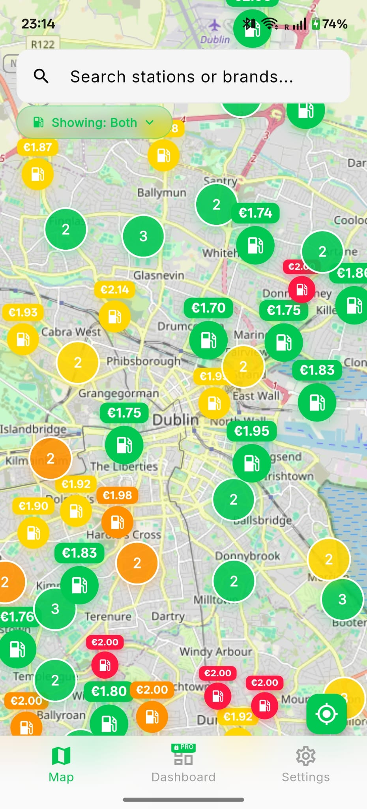
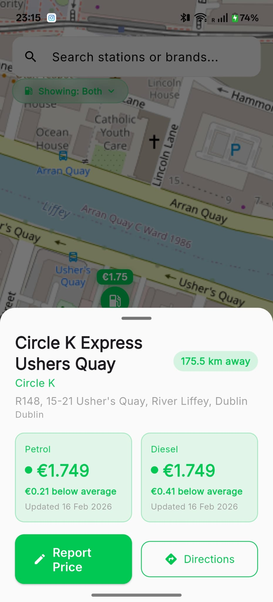
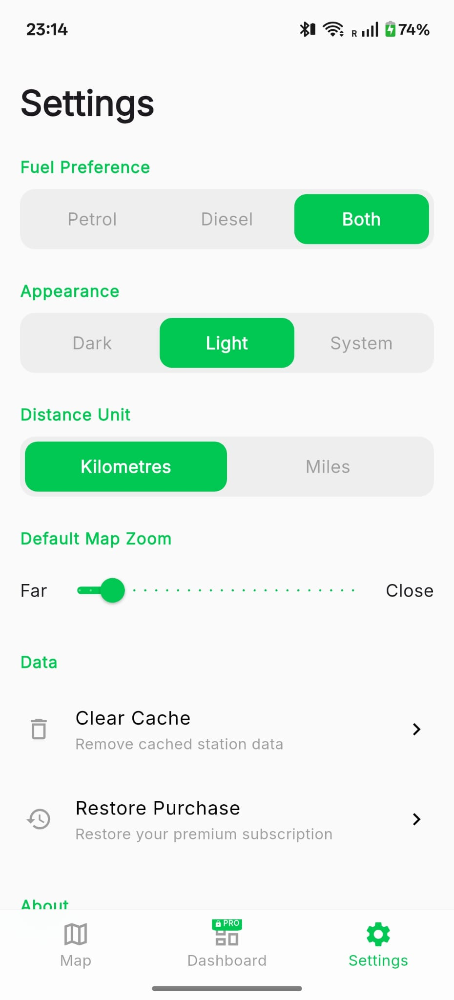
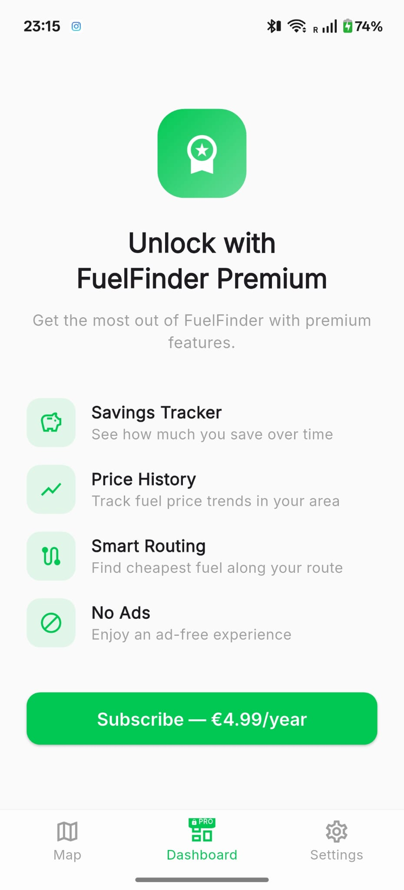

# FuelFinder Ireland

Find the cheapest petrol and diesel near you. Real prices, real stations, across all of Ireland.

> **Note:** This project is paused. The demo backend is inactive - to run it yourself, set up a Supabase instance using the included schema file. Takes about 5 minutes. I've added more info on how to do that below.

---

## The Problem

Ireland has no mandatory fuel price reporting. Prices vary by 20-30 cent per litre between stations in the same area, and drivers have no quick way to compare on mobile.

## The Solution

A mobile-first fuel price app with 1,668 real stations across the Republic of Ireland. Open the app, see what's near you, find the cheapest option.

Pick your fuel type on first launch, then you're straight into a map centered on your GPS location with color-coded station markers. No digging through menus or comparing numbers - you can see at a glance what's cheap and what's not.

🟢 More than 8c below average · 🟡 Slightly below · 🟠 Slightly above · 🔴 More than 8c above · ⚪ No price reported

Colors are based on the national average, not what's visible on screen - so a green station is genuinely cheap no matter where you're zoomed. Cheap stations are slightly larger on the map, expensive ones slightly smaller. Subtle, but your eye goes to the deals first.

Tap a station for the full breakdown: brand, address, both fuel prices, distance, data freshness, and how it compares to the national average. "Get Directions" hands off to Google Maps or Apple Maps. "Report Price" lets anyone submit what they see at the pump - no account needed.

Station clusters take the color of the cheapest station inside them, so you're encouraged to zoom in rather than skip past a group.

### Screenshots
 
   


## Built With

**Flutter + Dart** cross-platform mobile (Android + iOS from one codebase). **Supabase** (PostgreSQL) for the backend - station database, price storage, and row-level security. **OpenStreetMap** via `flutter_map` for the map - no usage caps. **Riverpod** for state management.

Previously loaded stations are cached locally via `shared_preferences`, so the app works offline. Map queries only run on the visible viewport, so it's not hammering the database every time you pan.

The national average for price colors is computed server-side and cached for 30 minutes, so marker colors stay consistent without recalculating constantly.

## Data

The initial dataset of 1,668 stations was sourced from publicly available Irish fuel station data covering the entire Republic of Ireland - station names, brands, addresses, coordinates, and the most recent reported prices for petrol and diesel.

The app is designed to layer crowdsourced reports on top of this seed data. The reporting flow is deliberately low-friction: tap a station, tap "Report Price", enter what you see at the pump. No account required. Prices are validated to a €1.00-€3.00 range.

## Running It Yourself

You'll need Flutter (3.41+), Android Studio (for the SDK), and a free Supabase project.

1. Clone the repo
2. Create a Supabase project at [supabase.com](https://supabase.com)
3. Run `supabase/schema.sql` in the Supabase SQL Editor to create tables, indexes, RLS policies, and helper functions
4. Optionally run the seed data migration to populate stations
5. Create a `.env` file in the project root:
```
SUPABASE_URL=https://your-project.supabase.co
SUPABASE_ANON_KEY=your-anon-key-here
```
6. Run the app:
```bash
flutter pub get
flutter run
```

## What Was Planned But Not Built

These features were designed and specced out before I paused the project:

- **Premium tier (€4.99/year)** - savings dashboard tracking money saved over time, smart route optimization that factors in fuel burned vs price saved, push notifications for price drops, price history charts, no ads
- **Smart routing** - calculates whether a cheaper station further away actually saves money after accounting for fuel consumption to get there. Uses OSRM (free routing engine) and the user's car profile (consumption rate, tank size)
- **Gamified crowdsourcing** - reporter leaderboard, freshness scores on prices, one-tap price confirmation when GPS detects you're at a station, free premium for active reporters
- **Themed map tiles** - CartoDB Dark Matter for dark mode, Positron for light mode (tested and ready)
- **Ad monetization** - AdMob banner on free tier (placeholder exists in the UI)
- **Chain data feeds** - automated scraping from Circle K, Applegreen, and Maxol station finders for fresher prices on major chains

## License

Open-source. Use as you wish :)
